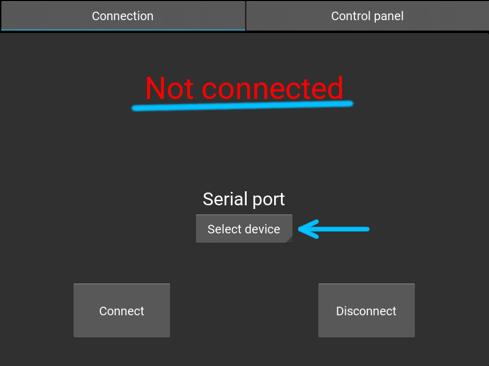
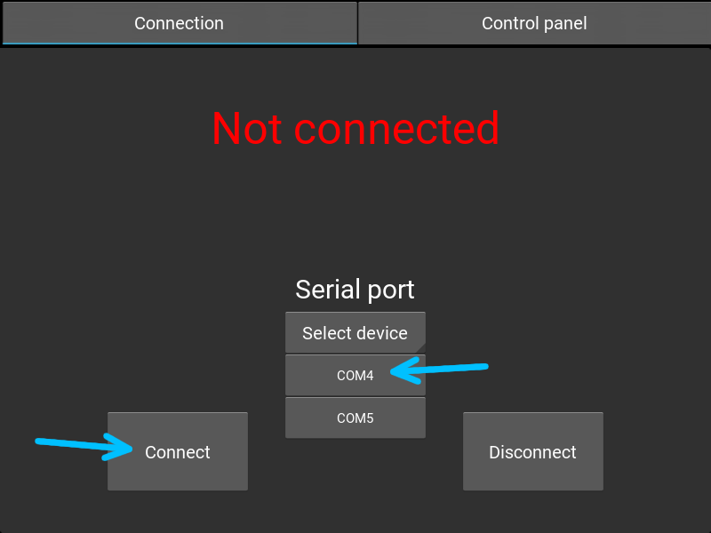
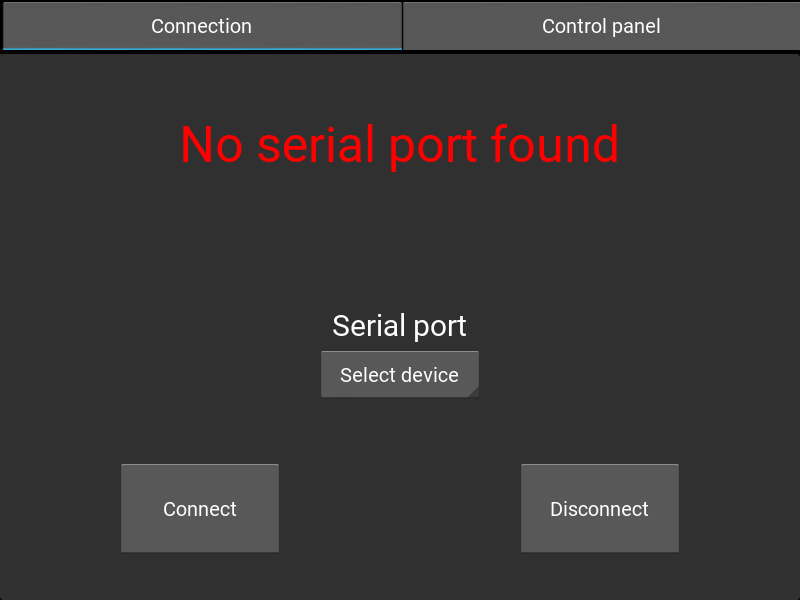
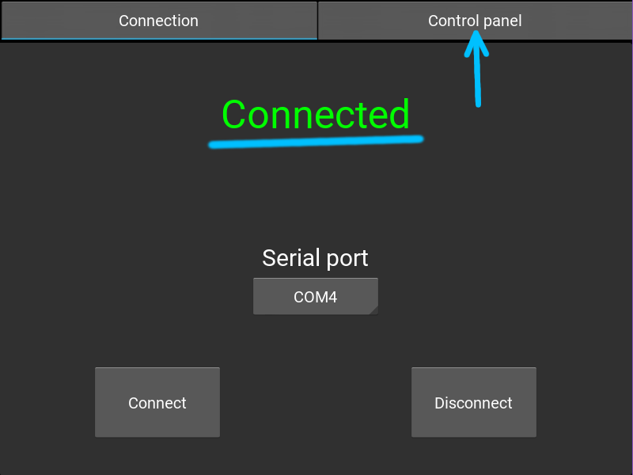
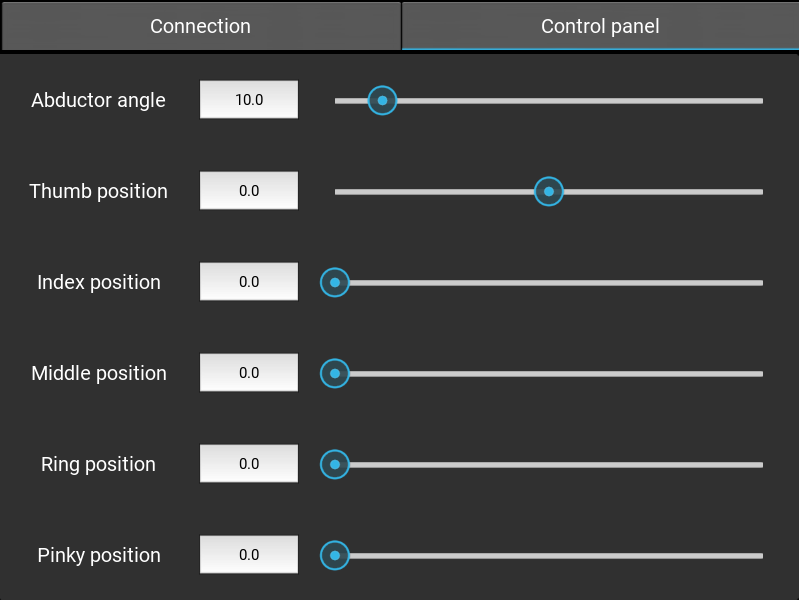
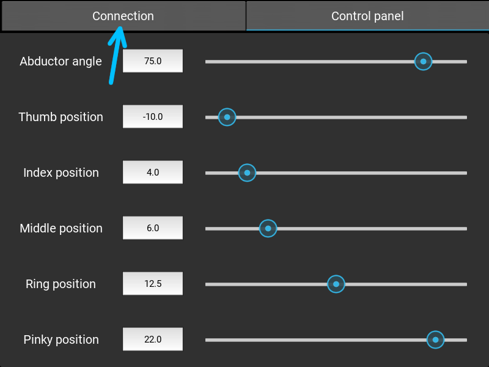
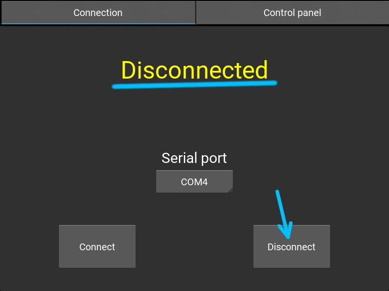

The Dextra Control GUI is designed using [Kivy](https://kivy.org/#home). Besides having Python installed, this library and its dependencies are required to run the application. The application uses both the *.py* and the *.kv* files, and they need to be in the same folder.

The Dextra Control GUI also uses the [Synapse](https://github.com/Alvipe/Synapse) Python module to manage communications between the PC and the microcontroller running the Dextra firmware. The *Synapse.py* file has to be in the same folder than the control GUI files.

To run the control GUI, connect the microcontroller running the Dextra firmware to a USB port of the computer, and run:

```bash
~/Dextra$ cd Control/GUI
~/Dextra/Control/GUI$ python DextraControl.py
```

First, the device to which we want to communicate (the microcontroller running the Dextra firmware) has to be selected from a dropdown list. Once the desired device is selected (in this case the one connected to COM4; in this example the app is running on a Windows PC), we click on the connect button. If there is no device connected to the PC, or no device is selected from the dropdown list, an error message is displayed.

<p align="center">
        
</p>

If the connection is successful, we can select the *Control panel* tab. In this tab, we can control the position of each finger and the abduction angle of the thumb. The position values can be inputted by using the text boxes or by moving the sliders.

<p align="center">
    
</p>

To stop communicating with the microcontroller, we select the *Connection* tab and click the disconnect button.

<p align="center">
    
</p>

