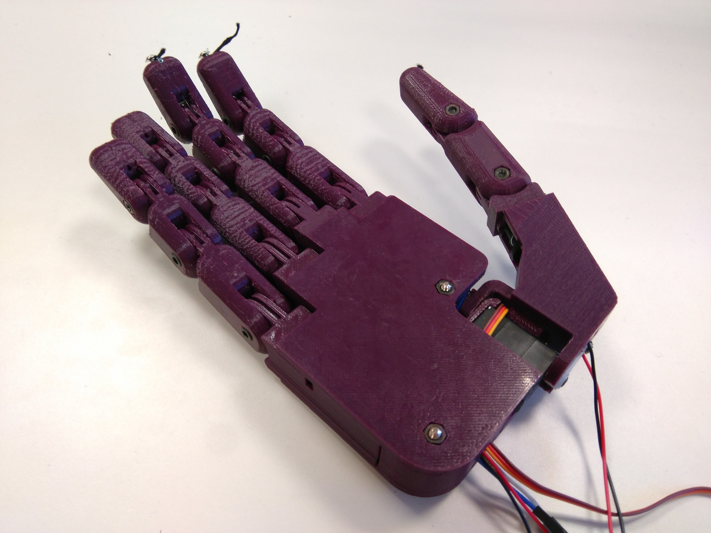
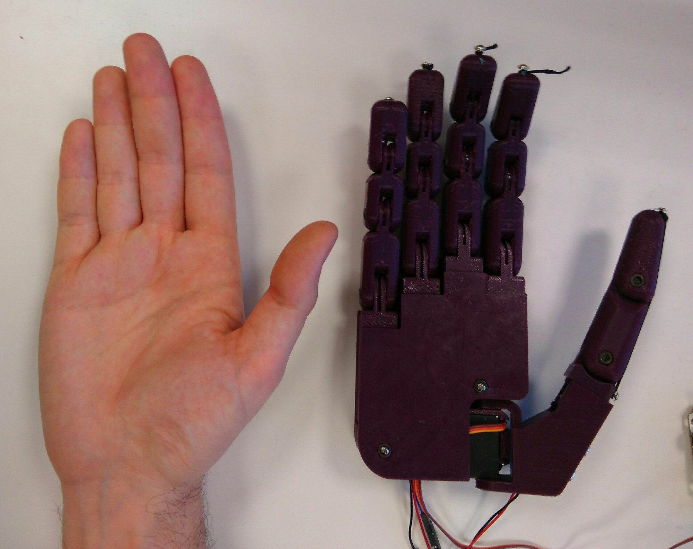
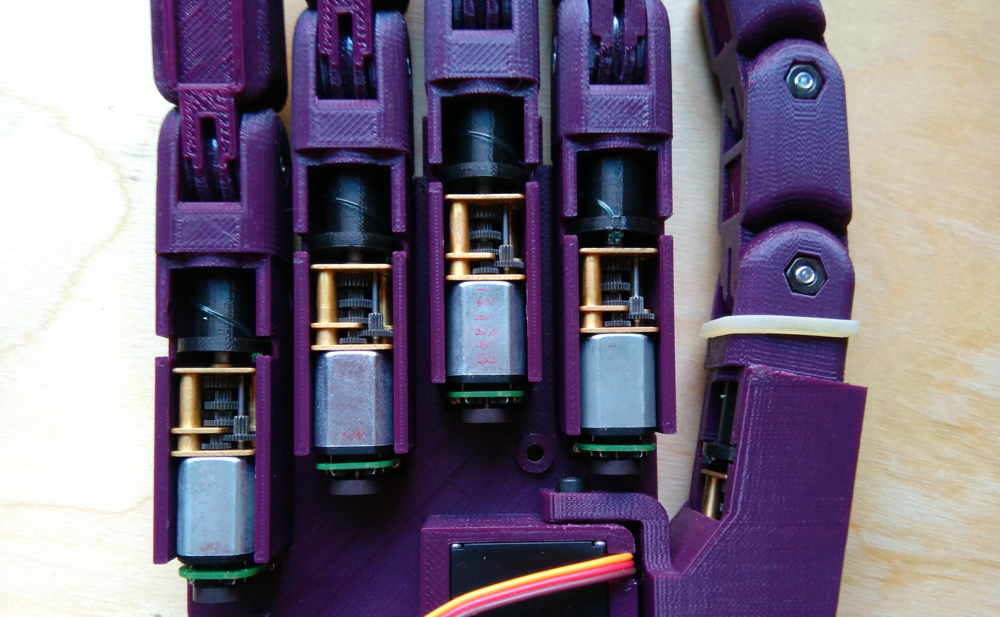

# Dextra
Dextra is a printable robotic hand with the size of a human hand. This project was initially started to build a replicable and low cost alternative to current robotic hand prostheses. However, I think this device has more potential uses, for example in robotics research (humanoid robotics, mobile platforms with manipulation capabilities) or in education, fields that could benefit from the existence of a cheap and easy to repair robotic hand, a robotic device that is replicable and hackable, and simple but functional.

    

The key design points of Dextra are: adaptive grip, compact size, mechanical simplicity and ease of replication. The mechanical design of Dextra revolves around the finger module the finger module, a modular part that comprises a compact linear actuator based on the Pololu 1000:1 Micro Metal Gearmotor HP, position feedback provided by a magnetic encoder, and the mechanical printable finger. This module is used in the four fingers of the hand, and the thumb is a variation of the same design. This makes assembly and repair simpler. Modular design also may favour the possibility of modifying the original design.

To reduce the size, as well as the mechanical complexity of Dextra, the fingers are underactuated, that is, they have more degrees of freedom (DOF) than actuators. Each finger module has three DOF and one motor, while the thumb has two DOF and one motor. Besides that, the abduction/adduction of the thumb is independently actuated by a RC servomotor.

The motion of the fingers of Dextra is controlled by a position control loop. Since the finger is underactuated, the angular position of each phalanx cannot be controlled independently. Instead, the total angular position of the finger, that is, the sum of the three joint angles, is controlled. Each finger is controlled by a PID loop that takes a position setpoint as the input and uses the feedback position measured by a magnetic quadrature encoder to adjust the real position of the DC motor driving the finger.

Dextra can be controlled either by sending commands from a computer with a GUI, or by using EMG signals, as would be done if the hand is used as a prosthesis. To implement the second type of control, an EMG interface called [Mumai](https://github.com/Alvipe/Mumai) is being used. Currently, a myoelectric threshold controller is implemented: the raw EMG signal provided by the EMG interface is rectified and smoothed by software and when this processed signal exceeds a certain value, the hand closes.

Here are some videos showing how Dextra works:
* [Open-loop finger control](https://www.youtube.com/watch?v=N3UU5vtAwHg)
* [Closed-loop finger control](https://www.youtube.com/watch?v=Uz6x0zFXkCc)
* [Myoelectric control](https://www.youtube.com/watch?v=L_VyQa0jCiI)

There is more information about Dextra on its [hackaday.io project page](https://hackaday.io/project/9890-dextra).

# Assembly instructions
The assembly instructions can be found [here](https://github.com/Alvipe/Dextra/tree/master/doc/dextra_assembly_instructions.pdf).

# Project index
* [Control](https://github.com/Alvipe/Dextra/tree/master/Control) - Code for different control methods (EMG, GUI)
* [Firmware](https://github.com/Alvipe/Dextra/tree/master/Firmware) - Main program and libraries that make Dextra move
* [Parts](https://github.com/Alvipe/Dextra/tree/master/Parts) - STL files of the printable parts of Dextra and its corresponding FreeCAD source files
* [doc](https://github.com/Alvipe/Dextra/tree/master/doc) - Documentation files

# License
  

Code is licensed under the [GPL v3 License](https://www.gnu.org/licenses/gpl-3.0.html). The rest of the work is licensed under the [Creative Commons Attribution-ShareAlike 4.0 International License](http://creativecommons.org/licenses/by-sa/4.0/).
